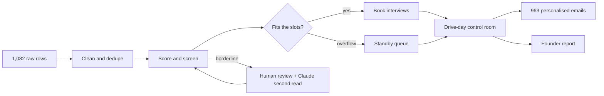

# Drive control room

**A campus hiring drive runs as one pipeline. 1,082 messy applications go in. A clean shortlist, a full interview day, 963 personalised emails and a founder report come out, in under a second.**


Campus hiring runs on spreadsheets, copy-pasted emails and a recruiter fixing schedules by hand on drive day. This project treats a hiring drive like an engineering system. The repetitive steps are automated, and every decision that matters goes back to a person.

---

## What happens when you press "Run the drive"



Results on the included dataset:

| Stage | Result |
|---|---|
| Rows in the file | **1,082** |
| Duplicates merged | **58** → 1,024 unique candidates |
| Fields fixed automatically | **4,341** |
| Took the online test | **972** (52 absent) |
| Met eligibility criteria | **750** |
| Shortlisted (auto cutoff: 73) | **50** |
| Interviews booked | **42 of 42 slots**, 8 on standby |
| Held for human review | **35** |
| Emails drafted | **963**, plus a call list of 26 with no valid email |
| Manual effort replaced | **about 103 hours** |

The effort figure uses stated assumptions: 1 minute per row cleaned, 3 per resume screened, 3 per interview booked and 2 per email.

---

## The five stages

### 1. Clean
Real application exports are messy, and this file is built to be messy in realistic ways.

- **Column auto-detection.** Headers like `E-mail ID`, `Mobile No` or `CGPA/Percentage` are mapped to the right fields by fuzzy matching, so any reasonable CSV loads.
- **Normalisation.** CGPA arrives as `8.2/10`, `82%` or `8.20 CGPA` and comes out on one scale. Campuses written as `IITB`, `MAHE Manipal` or `NIT Tiruchirappalli` resolve to 13 canonical names. Around 50 skill spellings (`golang`, `k8s`, `data structures`) map to standard terms. Phone numbers are reformatted as `+91 XXXXX XXXXX`.
- **Deduplication.** Repeat applications are matched on email or phone and merged field by field. Nothing useful is thrown away.
- **Before and after view.** The messiest rows are shown with the original value struck through under the cleaned one, so every change can be audited.

### 2. Screen
- **Explainable score out of 100.** The score is a weighted mix of online test, skills match, CGPA, and projects plus internship. Each candidate's profile shows exactly how many points each part contributed.
- **Live controls.** Any skill can be switched between must-have, nice-to-have and ignored. Weights and cutoffs re-rank all 1,024 candidates instantly.
- **Capacity-aware cutoff.** Instead of a fixed score, the cutoff is set so the shortlist fills the interview slots plus a small standby buffer. A fixed cutoff shortlisted about 200 people for 42 slots; the automatic one gets 50.
- **Eligibility gates.** These match common placement-cell rules: test attendance, minimum CGPA and active backlogs.
- **Review queue.** Candidates within 1.5 points of the cutoff, missing two or more must-haves, or with no CGPA are held for a human decision. They are never auto-rejected.
- **Blind review.** Name and campus never count toward the score, and blind mode hides them from the screen as well.

### 3. Schedule: the drive-day control room
- **Automatic booking.** Six panels with seven 45-minute slots each, a lunch break, and each candidate matched to a panel in their area (backend, data, frontend, platform). Overflow goes to standby in score order.
- **Running the day.** A clock slider moves the day forward and cells change from scheduled to live to done.
- **No-shows.** If a no-show is marked within the first 15 minutes, the next standby candidate takes the slot.
- **Panel dropouts.** When a panel drops out mid-day, its remaining interviews move to free slots at least 30 minutes ahead, area-matched where possible. Candidates with no slot go to the front of standby.
- **Drive log.** Every change is recorded in a timestamped log.

### 4. Notify
- **Six email types:** interview invite, time change, standby, missed, not progressing, and not eligible.
- **Personalised from the data.** Every email fills in the candidate's own time, panel, team, a real project from their application and their strongest relevant skill. For example: *"They're keen to hear about your rate limiter for a public API."*
- **Editable templates.** Templates use merge fields (`{first}`, `{time}`, `{panel}`, `{skill}` and others) with a live preview.
- **Call list.** Candidates with no valid email are routed to a call list instead of being dropped.
- **Mail-merge export.** One CSV is ready for Gmail mail merge or an n8n workflow.

### 5. Report
- **Founder brief.** A short plain-language summary: what happened and what needs a decision.
- **Decisions needed.** This list is generated from the state of the drive: standby approvals, borderline candidates, panel cover, call list and no-shows.
- **Shortlist rate by campus.** Shows which campuses are worth returning to next season.
- **Full tracker export.** One row per candidate with score, status, reason, slot and panel.

---

## How AI is used, and where it isn't

Claude is used where judgement on unstructured text helps. It is never used as the decision-maker.

| Feature | What Claude does | Guardrail |
|---|---|---|
| Review queue | Gives a second read on up to 12 borderline candidates: lean, a one-line reason, and an interview question that would settle the doubt | Claude never sees names, campuses or contact details. Its view is advisory and a person still clicks Shortlist. |
| Email templates | Rewrites a template warmer, shorter or more formal | The rewrite is rejected automatically if any merge field is dropped |
| Founder brief | Rewrites the summary for founders | It may only use the numbers on the page, which are passed in as structured facts |

Cleaning, scoring, scheduling and email generation are deterministic code. They are fast, reproducible and can be explained line by line. The AI features run when the page is opened as a Claude artifact. Everything else works in any browser.

---

## Try it

1. Download `drive-control-room_ai-campus-hiring.html` and open it in any browser. There is nothing to install.
2. Press **Run the drive** to use the built-in sample of 240 applications.
3. Click **Load your CSV** and pick `campus-drive-applications_1024-students.csv` to run the full 1,024-student drive.
4. In **Schedule**, drag the clock past 10:00 AM, mark a no-show, then drop a panel and watch the plan repair itself.

---

## The dataset

`campus-drive-applications_1024-students.csv` contains **1,024 synthetic students** across 1,082 rows. No real person is in it.

| Property | Detail |
|---|---|
| Campuses | 13: five IITs, four NITs, three BITS campuses and **MIT Manipal** (the largest, at 152 students) |
| Columns | Name, email, phone, college, branch, CGPA, backlogs, skills, test score, projects, internship |
| Built-in mess | 58 duplicates, five spellings per campus, mixed CGPA formats, inconsistent name casing, phone formats with and without +91, skill synonyms, `AB`/`Absent` test entries, missing emails |
| Realism | Test score, CGPA, skills, projects and internships are correlated through a shared ability factor, as in real cohorts |
| Reproducible | Generated from a fixed random seed |

---

## Built with

- **One self-contained HTML file.** Vanilla JavaScript and CSS, about 70 KB, with no frameworks and no build step.
- **Performance.** The whole pipeline runs over 1,000+ candidates in a fraction of a second, in the browser.
- **Accessibility.** Responsive down to mobile, light and dark themes, visible keyboard focus, and reduced-motion support.
- **Claude.** Used as a coding partner during development, and as the in-app AI through the artifact runtime.

```
├── drive-control-room_ai-campus-hiring.html     the app
├── campus-drive-applications_1024-students.csv  synthetic dataset
└── README.md
```

---

## What I'd build next

- **n8n workflow.** A Google Form webhook triggers the pipeline, and its results land in Google Sheets and Gmail with no one opening the app.
- **Interviewer feedback forms** that feed straight into the offer decision and the founder report.
- **Cross-season analytics.** Which campuses and test-score bands actually convert into strong hires.
